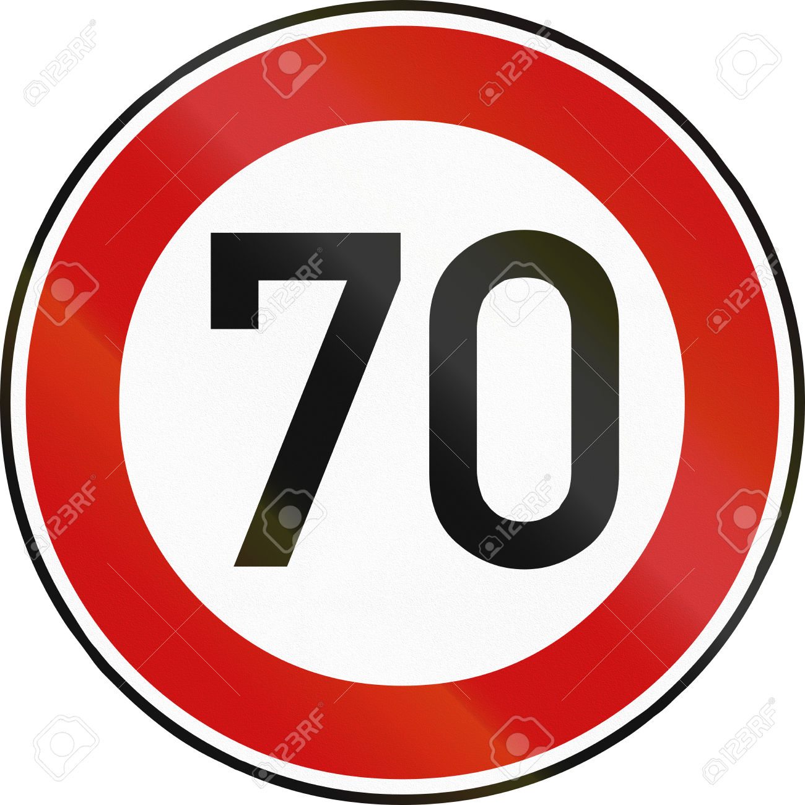

# **Traffic Sign Recognition** 

## GOAL

**Build a Traffic Sign Recognition Project**

The goals / steps of this project are the following:
* Load the data set (see below for links to the project data set)
* Explore, summarize and visualize the data set
* Design, train and test a model architecture
* Use the model to make predictions on new images
* Analyze the softmax probabilities of the new images
* Summarize the results with a written report

[//]: # (Image References)

[image1]: ./histogram.jpg "Visualization"
[image2]: ./examples/grayscale.jpg "Grayscaling"
[image3]: ./examples/random_noise.jpg "Random Noise"
[image4]: ./test_images/up.jpg "Traffic Sign 1"
[image5]: ./test_images/yield.jpg "Traffic Sign 2"
[image6]: ./test_images/30.jpg "Traffic Sign 3"
[image7]: ./test_images/70.jpg "Traffic Sign 4"
[image8]: ./test_images/rightdown.jpg "Traffic Sign 5"

## Rubric Points
###Here I will consider the [rubric points](https://review.udacity.com/#!/rubrics/481/view) individually and describe how I addressed each point in my implementation.  

---
### Writeup / README

#### 1. Provide a Writeup / README that includes all the rubric points and how you addressed each one. 

You're reading it! and here is a link to my [project code](https://github.com/udacity/CarND-Traffic-Sign-Classifier-Project/blob/master/Traffic_Sign_Classifier.ipynb)

### Data Set Summary & Exploration

#### 1. Provide a basic summary of the data set and identify where in your code the summary was done. In the code, the analysis should be done using python, numpy and/or pandas methods rather than hardcoding results manually.

The code for this step is contained in the second code cell of the IPython notebook.  

I used the pandas library to calculate summary statistics of the traffic
signs data set:

* The size of training set is = 34799
* The size of test set is = 12630
* The shape of a traffic sign image is = (32,32,3)
* The number of unique classes/labels in the data set is = 43

#### 2. Include an exploratory visualization of the dataset and identify where the code is in your code file.

The code for this step is contained in the third code cell of the IPython notebook.  

Here is an exploratory visualization of the data set. It is a bar
chart showing the distribution of labels in the training set.

Also I plotted out all the images for each label.

![alt text][image1]

### Design and Test a Model Architecture

#### 1. Describe how, and identify where in your code, you preprocessed the image data. What tecniques were chosen and why did you choose these techniques? Consider including images showing the output of each preprocessing technique. Pre-processing refers to techniques such as converting to grayscale, normalization, etc.

The preprocessing takes place as each batch is created prior to being
loaded. 

As a first step, I decided to convert the images to grayscale because
the color is less important than the contrast between elements of the sign  . 

Here is an example of a traffic sign image before and after grayscaling.

![alt text][image2]

As a last step, I normalized the image data so that all values are between 0 and 1. This usually helps in lessening the possibility of big numbers affecting the processing step.

#### 2. Describe how, and identify where in your code, you set up training, validation and testing data. How much data was in each set? Explain what techniques were used to split the data into these sets. (OPTIONAL: As described in the "Stand Out Suggestions" part of the rubric, if you generated additional data for training, describe why you decided to generate additional data, how you generated the data, identify where in your code, and provide example images of the additional data)

The code for splitting the data into training and validation sets is contained in the fifth code cell of the IPython notebook.  

To cross validate my model, I randomly split the training data into a training set and validation set. 

My final training set had 34799 number of images. My validation set and test set had 4410 and 12630 number of images.

#### 3. Describe, and identify where in your code, what your final model architecture looks like including model type, layers, layer sizes, connectivity, etc.) Consider including a diagram and/or table describing the final model.

The code for my final model is located in the seventh cell of the ipython notebook. 

My final model is an LeNet (modified to accomodate 43 classes and 32x32x1 input) model with :
1. an extra convolution layer 
2. an extra max-pooling layer
3. an additional deep network layer - outputs of 280

(I made this modifiction to increase the validation accuracy). 

| Layer         		|     Description	        					| 
|:---------------------:|:---------------------------------------------:| 
| Input         		| 32x32x3 RGB image   							| 
| Covert to Gray Scaled | 32x32x1  |
| Convolution 5x5     	| 1x1 stride, same padding, outputs 32x32x6 	|
| RELU					|												|
| Max pooling	      	| 2x2 stride,  outputs 32x32x6				|
| Convolution 5x5     	| 1x1 stride, valid padding, outputs 28x28x6 	|
| RELU					|												|
| Max pooling	      	| 2x2 stride,  outputs 14x14x6 				|
| Convolution 5x5	    | 1x1 stride, valid padding, outputs 10x10x16 |
| RELU					| |
| Max pooling	      	| 2x2 stride,  outputs 5x5x16 				|
| Flatten |  outputs 400x1  |
| Fully connected		|    outputs 280 							|
| RELU |   |
| Fully connected		|    outputs 120 							|
| RELU |   |
| Fully connected		|    outputs 84 							|
| RELU |   |
| Fully connected		|    outputs 43							|
| Softmax				| 					|

#### 4. Describe how, and identify where in your code, you trained your model. The discussion can include the type of optimizer, the batch size, number of epochs and any hyperparameters such as learning rate.

The code for training the model is located in the eigth cell of the ipython notebook. 

To train the network I used the following:
optimizer = AdamOptimizer
batch size = 256
number of epochs = 9
learning_rate = 0.005

#### 5. Describe the approach taken for finding a solution. Include in the discussion the results on the training, validation and test sets and where in the code these were calculated. Your approach may have been an iterative process, in which case, outline the steps you took to get to the final solution and why you chose those steps. Perhaps your solution involved an already well known implementation or architecture. In this case, discuss why you think the architecture is suitable for the current problem.

The code for calculating the accuracy of the model is located in the ninth cell of the Ipython notebook.

My final model results were:
* training set accuracy of 0.988
* validation set accuracy of =  *0.934*
* test set accuracy of = 0.902

I chose a well known architecutre *Le Net* and added 1 convolution layer, 1 max pooling in front of it and then 1 fully connected layer. 

* What architecture was chosen?
I used the LeNet architecture was relevant because its well known
for recognizing numbers and letters (shapes) in images. 

* Why did you believe it would be relevant to the traffic sign application?

Traffic signs contain letter-like elements in the images thus the elements were similar to what is used by LeNet.

* How does the final model's accuracy on the training, validation and test set provide evidence that the model is working well?
I changed the number of epochs to 7 - ie where the validation error started dropping. 
The validation and test set are >= 0.85 and the training was near 0.97 so this shows that the training has 

After this point the validation accuracy started dropping. 

### Test a Model on New Images

#### 1. Choose five German traffic signs found on the web and provide them in the report. For each image, discuss what quality or qualities might be difficult to classify.

Here are five German traffic signs that I found on the web:

![alt text][image4]
The above ^ image is bright and has high contrast so should be classfied easily. 

![alt text][image5] 
This above ^ image is also bright and high contrast so should be cclassified correctly. 

The above ^ image is occluded by watermarks but its still bright and has good contrast so should be classfied well.

The above ^ image is occluded by watermarks all over the image. Also if you look in the training set, most of the images for this sign are very low in contrast and very dark. This might cause problems for the system to classify. 

The above image has water marks but the contrast is very high and it only has 2 colors and the image is very defined so I thikn it will be correctly classified. 

#### 2. Discuss the model's predictions on these new traffic signs and compare the results to predicting on the test set. Identify where in your code predictions were made. At a minimum, discuss what the predictions were, the accuracy on these new predictions, and compare the accuracy to the accuracy on the test set (OPTIONAL: Discuss the results in more detail as described in the "Stand Out Suggestions" part of the rubric).

The code for making predictions on my final model is located in the tenth cell of the Ipython notebook.

Here are the results of the prediction:

| Image			        |     Prediction	        					| 
|:---------------------:|:---------------------------------------------:| 
| Straight Only   		| Straight Only   								| 
| Yield     			| Yield 										|
| 30 km/h				| 30 km/h										|
| 70 km/h        		| 30 km/h				 		         		|
| Right turn	        | Right Turn 					  		|

The model was able to correctly guess 4 of the 5 traffic signs, which
gives an accuracy of 80%. This compares favorably to the accuracy on
the test set of . 

#### 3. Describe how certain the model is when predicting on each of the five new images by looking at the softmax probabilities for each prediction and identify where in your code softmax probabilities were outputted. Provide the top 5 softmax probabilities for each image along with the sign type of each probability. (OPTIONAL: as described in the "Stand Out Suggestions" part of the rubric, visualizations can also be provided such as bar charts)

The code for making predictions on my final model is located in the 11th cell of the Ipython notebook.

For the *Images 1,2,3 & 5 , the model was fairly certain and it was correct*

| Probabilty			        |     Prediction	        	| 
|:---------------------:|:---------------------------------------------:| 
| 0.99	        	| Straight Only   								| 
| 1.0     	   		    | Yield 										|
| 0.994				    | 30 km/h										|
| 0.99	                | Right Turn 					  		|

The TOP5 predictions are given below:
TopKV2(values=array([  9.99749482e-01,   2.50502781e-04,   4.56681910e-08,
         9.83950588e-10,   2.69000711e-10], dtype=float32), indices=array([35, 28, 12, 38, 25], dtype=int32))
TopKV2(values=array([  1.00000000e+00,   3.31626843e-13,   1.10254221e-14,
         8.82234790e-15,   1.79645245e-18], dtype=float32), indices=array([13,  5, 35, 12,  1], dtype=int32))
TopKV2(values=array([  9.94446635e-01,   3.62874055e-03,   1.07797654e-03,
         3.99125885e-04,   1.94915148e-04], dtype=float32), indices=array([ 1, 19, 11,  0, 36], dtype=int32))
TopKV2(values=array([  9.99965549e-01,   3.44055588e-05,   2.32973774e-09,
         4.91888086e-10,   4.83101503e-10], dtype=float32), indices=array([39, 31, 19,  4, 25], dtype=int32))

*The 4th image it got wrong:*
TopKV2(values=array([  8.03280473e-01,   1.92512631e-01,   2.65286886e-03,
         9.36822558e-04,   4.64053883e-04], dtype=float32), indices=array([38, 18,  2, 14, 26], dtype=int32))
         
I have given the probabilities below:

| Probability         	|     Prediction	        					| 
|:---------------------:|:---------------------------------------------:| 
| 0.80        			| 30 kp/h									| 
| 0.19    				| Warning										|
| 0.00026				| 80 kp/h 							|
| 0.000094      			| Stop					 	|
| 0.000046	    | Traffic Light 	        	  			|

REASONING: 
Also the contrast of the 70 kp/h sign is very low. 